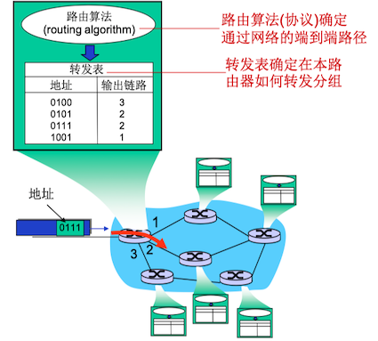
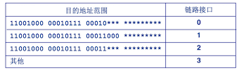
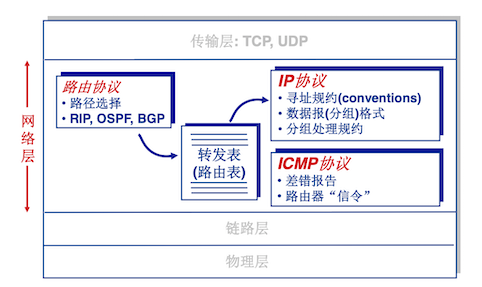
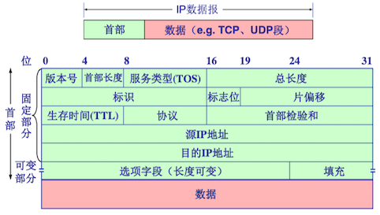
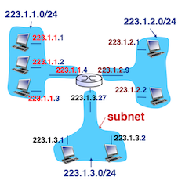
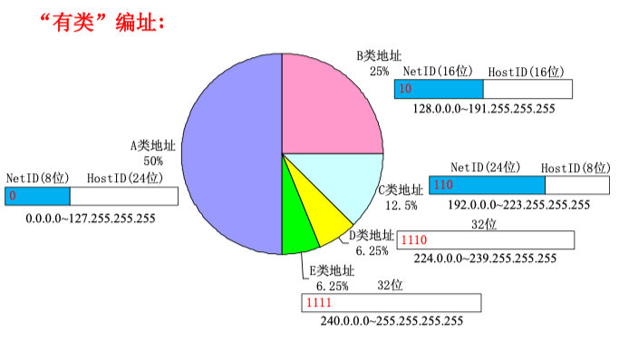
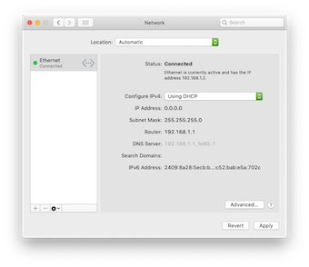
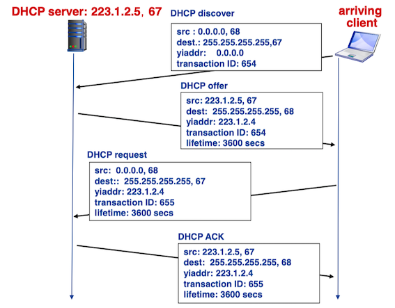
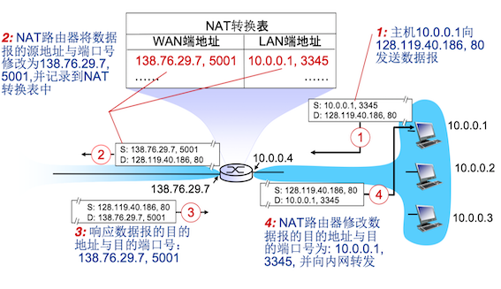
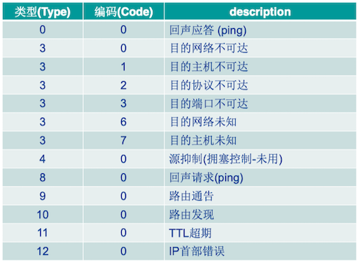

### 1 概述

网络层将分组从一台发送主机移动到一台接收主机，需要两种重要的网络层功能：

* **转发**(forwarding)：当一个分组到达路由器的一条输出链路时，路由器必须将该分组移动到适当的输出链路。
* **路由选择**(routing)：当分组从发送方流向接收方时，网络层必须决定这些分组所采用的路径。计算路径的算法被称为路由选择算法(routing algorithm)。

每台路由器具有一张**转发表**(forwarding table)。路由器通过检查到达分组首部字段的值来转发分组，然后使用该值在该路由器的转发表中索引查询。存储在转发表项中的该首部的值指出了该分组将被转发的路由器的输出链路接口。

!!! note "链路层交换机和路由"

    **分组交换机**(*packet switch*)是指一台通用分组交换设备，它根据分组首部字段中的值，从输入链路接口到输出链路接口转移分组。基于链路层字段中的值做转发的称为**链路层交换机**(*link-layer switches*)，基于网络层中的值做转发的分组交换机称为**路由器**(*routers*)。

### 2 虚电路和数据报网络

与运输层类似，网络层也能够在两台主机之间提供无连接服务或有连接服务。虽然有类似之处，但也存在重大差异：

* 网络层提供的是主机到主机的服务，运输层提供的是进程到进程的服务；
* 网络层不能同时提供这两种服务：仅在网络层提供连接服务的计算机网络称为**虚电路**(Virtual-Circuit, VC)网络; 仅在网络层提供无连接服务的计算机网络称为**数据报**网络(datagram network)。

#### 虚电路网络

一条虚电路由如下组成：

* 源和目的主机之间的路径(即一系列链路和路由器)；
* VC号，沿着该路径的每段链路的号码;
* 沿着该路径上每台路由器中的转发表表项。

属于一条虚电路的分组将在它的首部携带一个VC号。一条虚电路在每条链路上可能具有不同VC号，故每台中间路由器必须用一个新的VC号替代每个传输分组的VC号。该新的VC号从转发表获得。

虚电路中的3个阶段：

* 虚电路建立：在建立阶段，发送运输层与网络层联系，指定接收方地址，等待网络建立虚电路。网络层决定发送方和接收方之间的路径，即该虚电路的所有分组要通过的一系列链路和路由器。网络层也为沿着该路径的每条链路决定VC号。最后，网络层在沿着路径的每台路由器的转发表中增加一个表项。
* 数据传送：一旦创建了虚电路，分组就可以开始沿该虚电路流动了。
* 虚电路拆除：当发送方(或接收方)通知网络层它希望终止该虚电路时，就启动该阶段。然后网络层通常将通知网络另一侧的端系统结束呼叫，并更新路径上每台路由器中的转发表以表明该虚电路已不存在。

!!! note "运输层连接建立和网络层连接建立的区别"

    运输层的连接建立仅涉及两个端系统，两个端系统独自决定运输层连接的参数（初始序号和流量控制窗口长度），端系统知道该运输层连接，但网络中路由器对这些完全不知情。
    
    虚电路网络层，沿着两个端系统之间的路径上的路由器都要参与虚电路的建立，且每台路由器都完全知道经过它的所有虚电路。

端系统向网络发送指示虚电路启动与终止的报文，以及路由器之间传递的用于建立虚电路（即修改路由器表中的连接状态）的报文，被称为信令报文，用来交换这些报文的协议称为信令协议。

#### 数据报网络

数据报网络(datagram network)是仅在网络层提供无连接服务的计算机网络。每当端系统要发送分组，就为该分组加上目的端系统的地址，然后将该分组推进网络。每个路由器都使用分组的目的地址来转发该分组。每台路由器有一个将目的地址映射到链路接口的转发表；当分组到达路由器时，路由器使用该分组的目的地址在转发表中寻找适当的输出链路接口，然后路由器将分组向该输出链路接口转发。

由于目的地址可能性太多，在转发表中不可能与链路接口一一对应。所以一般采用以下方式转发：用分组的目的地址的前缀与该表中的表项进行匹配；如果存在一个匹配项，则路由器与该匹配项相联系的链路转发分组。当有多个匹配时，该路由器使用**最长前缀匹配规则**(longest prefix mating rule)：即在该表中寻找最长的匹配项，并向与最长前缀匹配相关联的链路接口转发分组。

  

### 3 路由器工作原理

略

### 4 网际协议

因特网的网络层有三个主要组件：

* IP协议
* 路由选择协议：计算出用于在网络中转发分组的转发表
* 互联网控制报文协议(ICMP): 网络层差错和信息报告的协议

#### 数据报格式
IPv4数据报格式：

* 版本号：IP协议的版本号
* 首部长度：IP分组首部的长度，以4字节为单位
* 服务类型(TOS)：指示期望获得哪种类型的服务
* 总长度：IP分组的总字节数(首部+数据)
* 生存时间(TTL)：IP分组在网络中可以通过的路由器数
    * 路由器转发一次分组，TTL减1
    * 如果TTL=0，路由器则丢弃该IP分组
* 协议：指示了数据部分应交给哪个特定的运输层协议
    * 仅在达到最终目的地才会有用 
    * 6为TCP，17为UDP 
* 首部校验和：实现对IP分组首部的差错检测
* 源IP地址、目的IP地址
* 选项字段：携带安全、源选路径、时间戳和路由记录等内容
* 填充字段：补齐整个首部，符合32位对齐

#### IPv4编址

一台路由器有多个接口，每个接口都有其链路。因为每台主机与路由器都能发送和接收IP数据报，IP要求每台主机和路由器接口拥有自己的IP地址。因此，一个IP地址技术上是与一个接口相关联的，而不是与包括该接口的主机或路由器相关联的。

IP地址不能随意自由选择。一个接口的IP地址的一部分需要由其连接的**子网**(subnet)来决定。

!!! example "子网"

    例如下图左上角的3台主机以及连接的路由器接口的IP地址中，最左侧的24比特(223.1.1)是相同的。这3个主机接口和1个路由器接口的网络形成了一个子网。223.1.1.0/24有时称为**子网掩码**(network mask)。任何其他要连接到223.1.1.0/24网络的主机接口都要求其地址具有223.1.1.xxx的形式。

    
32比特的IP地址被划分为两部分，形式为`a.b.c.d/x`，其中$x$指示了地址中的最高$x$位比特构成**网络号**(NetID)，剩余比特构成**主机号**(HostID)。一个组织通常被分配一块连续的地址，具有相同的前缀。

**分类编址**(classful addressing)：具有8、16、24比特子网地址的子网分别被称为A、B、C类网络。

特殊IP地址：

| NetID | HostID | 作为IP分组源地址  | 作为IP分组目的地址  | 用途  | 
| ----- | ----- | ---------- | -------- | -------------- |
| 全0 | 全0 | 可以 | 不可以 | 在本网范围内表示本机；在路由表中用于表示默认路由 (相当于表示整个Internet网络) |
| 全0 | 特定值 | 不可以 | 可以 | 表示本网内某个特定主机 |
| 全1 | 全1 | 不可以 | 可以 | 本网广播地址(路由器不转发) |
| 特定值 | 全0 | 不可以 | 不可以 | 网络地址，表示一个网络 |
| 特定值 | 全1 | 不可以 | 可以 | 直接广播地址，对特定网络上的所有主机进行广播 |
| 127 | 非全0或非全1的任何数 | 可以 | 可以 | 用于本地软件环回测试, 称为环回地址 | 

私有(Private)IP地址: RFC1918规定了三个保留地址段落, 分别处于A, B, C类的地址段，不向特定的用户分配。这些地址可以在任何组织或企业内部使用。

| Class | NetIDs | Blocks |  
| --- | --- | --- |
| A | 10 | 1 |
| B | 172.16 to 172.31 | 16 |
| C | 192.168.0 to 192.168.255 | 256 | 

为了获取一块IP地址用于一个组织的子网，该组织的网络管理员可以向他的ISP联系，ISP会从它的更大地址块中提供一些地址。ISP向因特网名字和编号分配机构(ICANN)组织申请分配IP地址。

#### DHCP

主机可以使用**动态主机配置协议**(DHCP)自动获取IP地址。否则将由网络管理员手工执行。DHCP广泛适用于住宅因特网接入网与无限局域网中，其中的主机频繁地加入和离开网络。

对于一台新到达的主机而言，DHCP协议可以分为四个步骤：

* DHCP服务器发现：新到达的主机生成包含DHCP发现报文(DHCP discover message)的IP数据报，通过广播目的地址(255.255.255.255)和本主机源地址(0.0.0.0)，传递给链路层，然后由链路层广播到所有与该子网连接的节点。
* DHCP服务器提供：DHCP服务器收到一个DHCP发现报文时，用一个DHCP提供报文(DHCP offer message)向客户做出响应，仍然使用IP广播地址。
* DHCP请求：从一个或多个服务器中选择一个，并向选中的服务器提供一个DHCP请求报文(DHCP request message)进行响应。
* DHCP确认：服务器采用DHCP ACK报文(DHCP ACK message)对DHCP请求报文进行响应。

<small>yiaddr = “your Internet address"</small>

#### NAT

**网络地址转换**(NAT, network address translation)协议：在私有地址和全局地址之间转换的协议。它具有以下特点：

* 只需从ISP申请一个IP地址
* 不占用新的IPv4地址
* 本地网络设备IP地址的变更，无需通告外界网络
* 变更ISP时，无需修改内部网络设备IP地址
* 内部网络设备对外界网络不可见，即不可直接寻址(安全)

#### ICMP

互联网控制报文协议(ICMP, Internet Control Message Protocol)最典型的用途是差错报告，例如"目的网络不可达"之类的错误报文。

