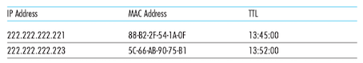

链路层的基本服务是*将数据报通过单一通信链路从一个结点移动到相邻节点*。运行链路层协议的任何设备均称为**节点**(node)，包括主机、路由器、交换机和WiFi接入点。链路层提供的服务细节随着链路层协议的不同而变化，协议能够提供的可能服务包括：

* 成帧(framing)。在每个网络层数据报经链路传送之前，几乎所有的链路层协议都要将其用链路层帧封装起来。
* 链路接入。MAC协议规定了帧在链路上传输的规则。
* 可靠交付。保证无差错地经链路层移动每个网络层数据报。通常是通过确认和重传取得的可靠服务。
* 差错检测和纠正。

链路层的主机部分是在网络适配器(network adapter)中实现的。位于网络适配器核心的是链路层控制器，其通常是一个实现了许多链路层服务的专用芯片(例如Intel 8254x控制器实现了以太网协议, Atheros AR5006控制器实现了802.11 WIFI协议)。

### 交换局域网

#### MAC地址

**MAC地址**(MAC address, Media Access Control Address)是一个用来确认网络设备位置的识别码。MAC地址长度为6字节，通常用十六进制表示法，地址的每个字节表示为一对十六进制数字。MAC地址固化在网卡的ROM中，有时也可以软件设置。局域网中的每块网卡都有一个唯一的MAC地址，它由IEEE统一管理和分配。

!!! note "保持各层独立"
    
    主机和路由器接口除了Ip地址以外还有MAC地址，有如下几个原因：
    
    * 局域网是为任意网络层协议涉及的，如果适配器被指派IP地址的话，它将不能方便地支持其他网络层协议(例如IPX/DECnet)。
    * 如果适配器使用的是Ip地址，那么Ip地址必须存储在适配器中，并且每次移动时都需要重新配置。

#### ARP

**ARP协议**(地址解析协议, Address Resolution Protocol)用于IP地址和MAC地址之间的转换。每台主机或路由器在其内存中具有一个**ARP表**(ARP table)，其包含了IP地址到MAC地址的映射关系，同时也包含了一个寿命(TTL)值。

