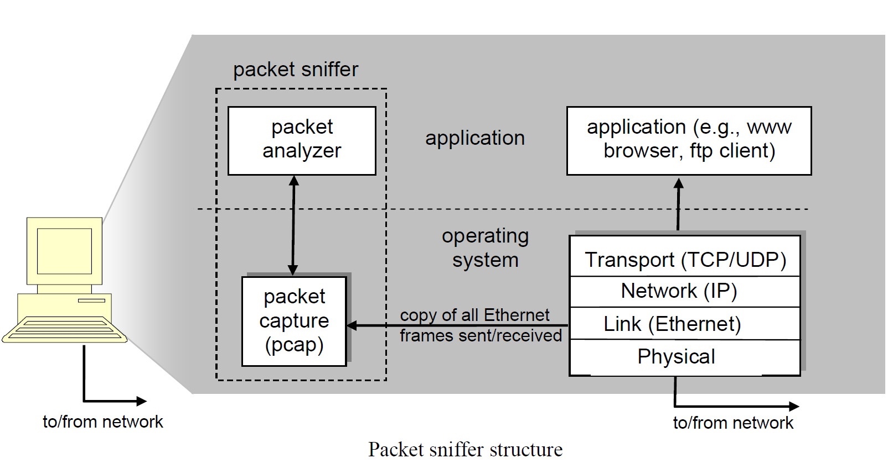
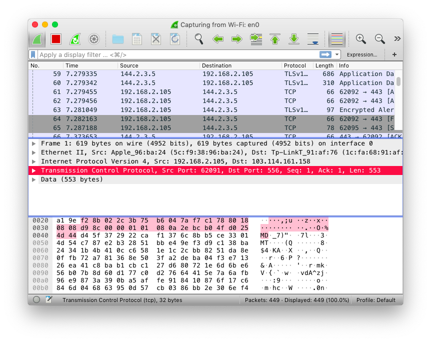
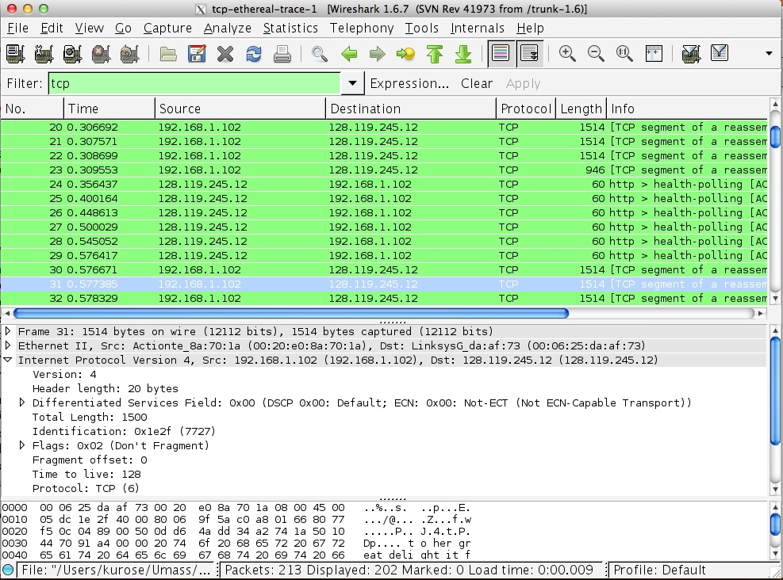

###  入门

[WireShark](https://www.wireshark.org) is a free network protocol analyzer.

A packet sniffer(分组嗅探器) captures (“sniffs”) messages being sent/received from/by your computer; it will also typically store and/or display the contents of the various protocol fields in these captured messages.

The packet sniffer consists of two parts:

* **packet capture library** receives a copy of every link-layer frame that is sent from 1 or received by your computer.
* **packet analyzer** displays the contents of all fields within a protocol message.

### 探究HTTP

略

### 探究TCP

在本实验中，我们将详细研究著名的TCP协议的行为。 我们将通过从您的电脑向远程服务器传输一份150KB的文件(一份 Lewis Carrol的“爱丽丝梦游仙境”文本)，并分析TCP传输内容的发送和接收过程来实现。我们将研究TCP对序列和确认号的使用，以提供可靠的数据传输；我们将看到TCP的拥塞控制算法 – 慢启动和拥塞避免 – 在过程中，我们将看看TCP的接收器发送流量控制的机制。 我们还将简要地观察TCP连线的设置，我们还会研究计算机和服务器之间TCP连线的性能(吞吐量和往返时间)。

#### 捕获从计算机到远程服务器的批量TCP传输

在开始我们对 TCP 的探索之前，我们需要使用Wireshark来获取文件从计算机到远程服务器的TCP传输的数据包内容。您可以通过访问一个网页，在网页上输入您计算机上存储的文件名称(包含 Alice in Wonderland 的 ASCII 文本)，然后使用 HTTP POST方法将文件传输到Web服务器。 我们使用POST方法而不是GET方法，因为我们希望将大量数据从您的计算机传输到另一台计算机。当然，我们将在此期间运行Wireshark以获取从您的计算机发送和接收的TCP区段的内容。

执行以下步骤：

* 启动 Web 浏览器。 在[网页](http://gaia.cs.umass.edu/wireshark-labs/alice.txt)上查看Alice in Wonderland 的ASCII档案文件。将此文件存储在计算机上。
* 接下来去[这个网页](http://gaia.cs.umass.edu/wireshark-labs/TCP-wireshark-file1.html)。
* 使用此表单中的“Browse…”按钮在计算机上输入包含Alice in Wonderland 的文件名(完整路径名)(或手动执行)。这个时候请不要按下“Upload alice.txt file”按钮。
* 启动Wireshark并开始数据包捕获 (Capture-> Start)，然后在Wireshark数据包捕获选项视窗上按OK(我们不需要在此处选择任何选项)。
* 返回浏览器，按“Upload alice.txt file”按钮将文件上传到gaia.cs.umass.edu服务器。文件上传后，浏览器窗口中会显示一条简短的祝贺消息。
* 停止Wireshark数据包捕获。 您的Wireshark视窗内容应该类似于下面显示的内容。

####  跟踪包的初步观察

在详细分析TCP连接的行为之前，让我们先概看一下跟踪包的内容。

首先，在Wireshar 视窗顶部的显示的过滤器指定窗口中输入"tcp"(小写，无引号，并且不要忘记在输入后按enter 键！)，过滤Wireshark视窗中显示的数据包。

您应该看到的是计算机和gaia.cs.umass.edu之间的一系列TCP和HTTP讯息。您 应该看到包含 SYN 讯息的初始三次握手。您应该看到 HTTP POST 讯息。根据您 使用的 Wireshark 的版本，您可能会看到从您的计算机向 gaia.cs.umass.edu 发送一 系列“HTTP Continuation”讯息。 回想一下我们在早期的 HTTP Wireshark 实验室 中的讨论，这不是 HTTP Continuation 消息 – 这是 Wireshark 指示有多个 TCP 区段 用于承载单个 HTTP 讯息的方式。在 Wireshark 的最新版本中，您将在 Wireshark 显示的 Info 列中看到“[重新组装的 PDU 的 TCP 段]”，以指示此 TCP 区段包含 属于上层协议讯息的数据（在我们的示例中为， HTTP）。 您还应该看到从 gaia.cs.umass.edu 返回到您的计算机的 TCP ACK 区段。