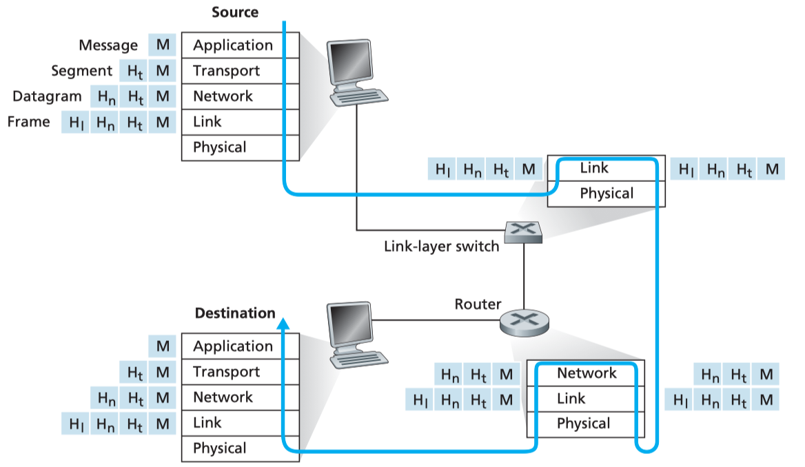

### 因特网

### 网络边缘

### 网络核心

### 分组交换网中的时延、丢包和吞吐量
### 协议层次及其服务模型

##### Layered Architecture

* 应用层: 支持各种网络应用
    * FTP, SMTP, HTTP, DNS
    * message(报文)
* 传输层: 进程-进程的数据传输
    * TCP, UDP
    * segment(报文段)
* 网络层: 源主机到目的主机的数据分组路由与转发
    * IP协议、路由协议等
    * datagram(数据报)
* 链路层: 相邻网络元素(主机、交换机、路由器等)的数据传输
    * 以太网(Ethernet)、802.11(WiFi)、 PPP
    * Frames(帧)

#### Encapsulation

### WireShark实验

[WireShark](https://www.wireshark.org) is a free network protocol analyzer.

A packet sniffer(分组嗅探器) captures (“sniffs”) messages being sent/received from/by your computer; it will also typically store and/or display the contents of the various protocol fields in these captured messages.

The packet sniffer consists of two parts:

* **packet capture library** receives a copy of every link-layer frame that is sent from 1 or received by your computer.
* **packet analyzer** displays the contents of all fields within a protocol message.

